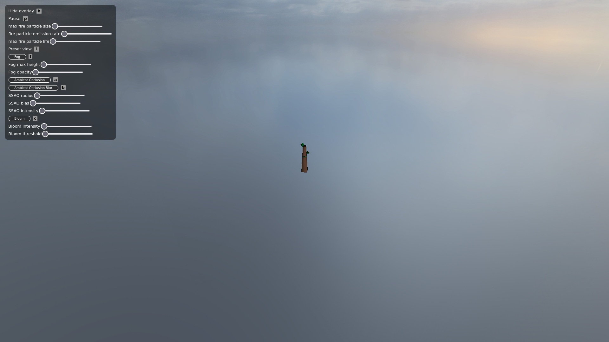
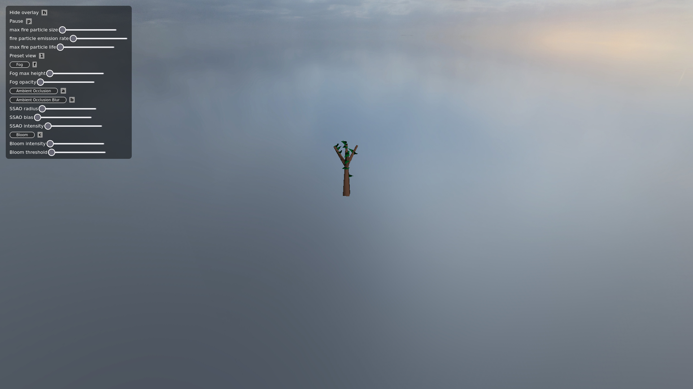
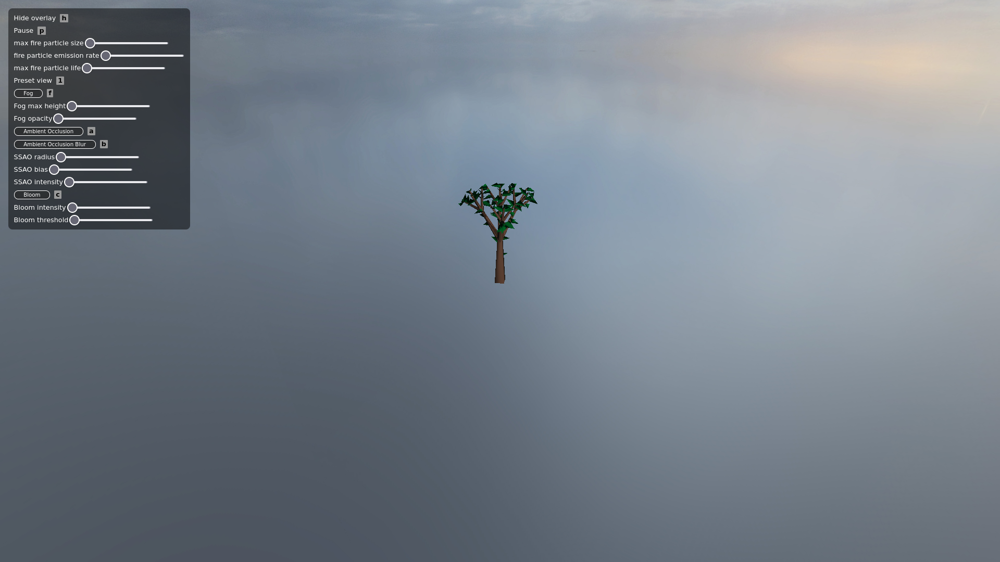
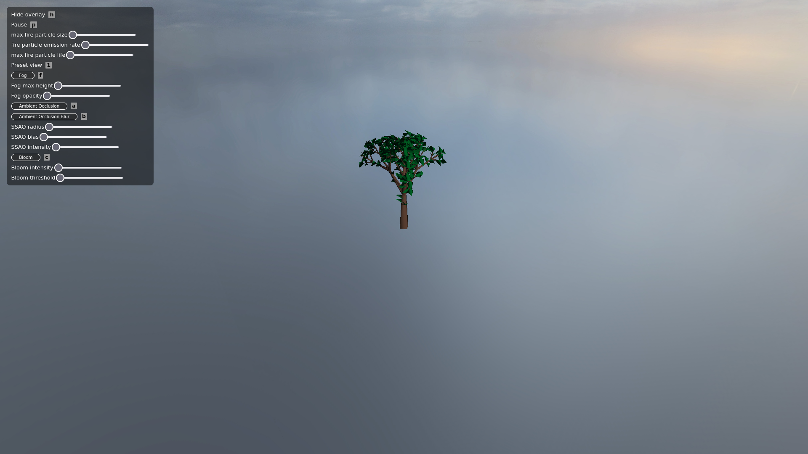
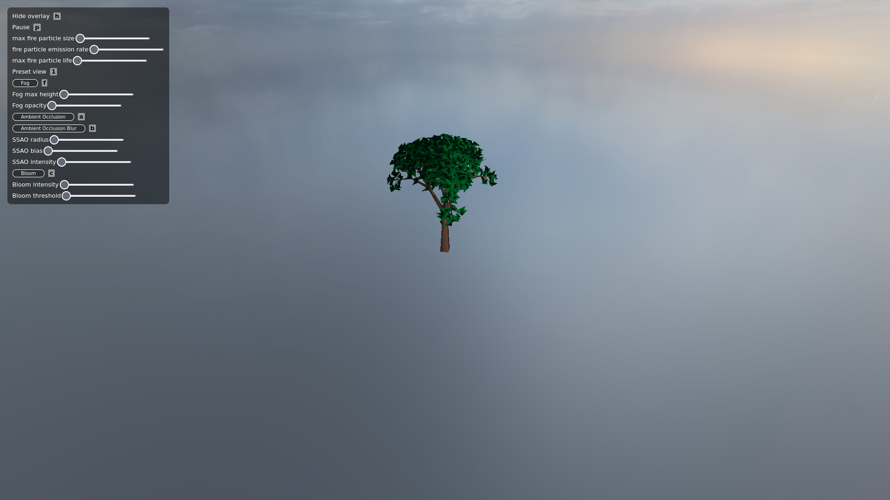

# Mystical Forest

<video src="videos/demo_teaser.mp4" height="300px" autoplay loop></video>

<figcaption style="text-align: center;">A short teaser video, gif, or image showing an overview of the final result.</figcaption>

## Abstract

In our project Mystical Forest, we have create a foggy, mystical forest, with a calming fire. We used ambient occlusion and fog to create a dim atmosphere, and added a fire generated with particles and bloom to enhance the light it produces. The trees are L-systems generated simulate a real forest.  

## Overview

<video src="videos/demo_detail.mp4" height="210px" autoplay loop style="vertical-align: middle;"></video>

<figcaption style="text-align: center;">Some more visuals focusing on interesting details of your scene.</figcaption>

We generated the trees procedurally using L-systems. This means they can be easily modified to create different types of trees, or other plants. blablabla @coaguila fill in this part. 

We also added a fog to create a more immersive atmosphere. The fog is implemented using a fragment shader that calculates the fog density based on the distance from the camera, and applies it to the scene. This gives a sense of depth and mystery to the forest, which is really cool to see. 

To add even more to the atmosphere, and because it's an interesting effect, we added screen-space ambient occlusion. This creates a more realistic lighting by simulating how light interacts with nearby environment, especially in the corners and crevices that we have on the trees. It gives a nice depth to the scene. 

Finally, we added a fire using particles. blablabla @Autek fill in this part. 

The terrain was made by hand in Blender, and we used the given shader to apply texture to it.

## Feature validation

<table>
	<caption>Feature Summary</caption>
	<thead>
		<tr>
			<th>Feature</th>
			<th>Adapted Points</th>
			<th>Status</th>
		</tr>
	</thead>
	<tbody>
		<tr>
			<td>Ambient Occlusion</td>
			<td>17</td>
			<td style="background-color: #d4edda;">Completed</td>
		</tr>
		<tr>
			<td>Particle Effects</td>
			<td>17</td>
			<td style="background-color: #d4edda;">Completed</td>
		</tr>
		<tr>
			<td>Fog</td>
			<td>4</td>
			<td style="background-color: #d4edda;">Completed</td>
		</tr>
		<tr>
			<td>L-Systems for Procedural Scene Generation</td>
			<td>8</td>
			<td style="background-color: #d4edda;">Completed</td>
		</tr>
		<tr>
			<td>Bloom</td>
			<td>4</td>
			<td style="background-color: #d4edda;">Completed</td>
		</tr>
	</tbody>
</table>

### Ambient Occlusion

#### Implementation

The ambient occlusion is implemented in screen space by using a fragment shader that samples the depth buffer to compute the occlusion factor: it compares the depth of the current fragment with the depth of nearby fragments to determine how much light is occluded. We then apply that factor to the ambient light of the scene to reduce it in areas that should be dimmed. A bias is applied to deal with acnee, and a later blur pass smoothes the result to avoid harsh edges.

The occlusion factor is computed in three passes:
1. **G-buffer pass:** we render the scene to a simple G-buffer with three textures in different color attachement (position, normal and albedo). We couldn't use the syntax given in the OpenGL tutorial since we are working in WEBGL1.0 instead of WEBGL2.0. This is done in `gbuffer_sr.js`, `gbuffer.vert.glsl` and `gbuffer.frag.glsl`.
  
<!-- todo: add images of different parts of the gbuffer -->

1. **SSAO pass:** this pass computes the ambient occlusion factor. In `ssao_sr.js`, we generate a kernel of random samples and a random rotation texture and pass it to the shaders. The vertex shader is a simple buffer-to-screen shader, but the fragment shader `ssao.frag.glsl` computes the occulsion factor. It iterates on the random (rotationned) samples, gets the value of the G-buffer at that point, transforms it to screen-space and computes and only increments the occlusion factor if the depth of the sample is visible from the viewer's point of view. The occlusion factor is then normalized by the number of samples. 

	There are multiple tweakable parameters to adjust the effect:
	  - kernel size: the number of samplse in the kernel. The more samples we have, the more accurate the result is, but also the more expensive it is to compute. We found that 64 samples was a good middle ground.
	  - radius: the radius in which the occlusion factor is computed. The larger the radius is, the larger the area of influence of the occlusion is. To avoid hard cuttoffs, the border should be smoothstep'd.
	  - bias: the bias is used to avoid acne like is done in other shadowing techniques.
	  - intensity: the intensity of the occlusion. It's just a power applied to the final occlusion factor to make it more or less pronounced.

<!-- todo: add images of only ssao buffer -->

1. _(optional)_ **Blur pass:** this pass smoothes the result of the SSAO pass to avoid harsh edges. It applies a 4x4 box blur to the SSAO texture. This is done in `blur_sr.js`, `buffer_to_screen.vert.glsl` and `blur.frag.glsl`. We found that a box blur was sufficient for our needs since SSAO is already a discreet effect so the diffence between box blur and guassian blur was not visible.

<!-- todo: add images of blur on ssao -->

After having computed the ambient occlusion factor, we integrate it to the scene by passing it to the Blinn-Phong and terrain shaders, and multiplying it with the ambient light component. 

#### Validation

TODO

### Particle Effects

#### Implementation

This implementation simulates dynamic fire particles using instanced, textured quads that evolve and fade over time. Each particle is rendered as a camera-facing billboard, with GPU rendering and CPU simulation. A fire emitter spawns and evolves over time, with configurable parameters for size, lifespan, emission rate, color options, speed, fire radius.

---

##### Pipeline Structure

  - A FireEmitter extends a general ParticleEmitter class.
  - A FireEmitter manages particle state: position, velocity, life, color, spawn radius, size.
  - On each frame:
    - Dead particles are culled.
    - New ones are spawned based on emissionRate.
    - Attributes are updated using remaining lifetime (RGB and alpha).
  - Results are exported into two arrays: positions (vec4: x, y, z, size) and colors (RGBA uint8).
  - A base quad (2D unit square) is instanced per particle.
  - Quads are billboarded in the vertex shader.
  - Alpha blending is enabled for additive effects this works well for flames and will benefit from bloom.
---

##### Design Choices

- CPU simulation: because it is simpler than compute shaders and sufficient for our use.

#### Validation

<video src="videos/fire.mp4" height="210px" autoplay loop style="vertical-align: middle;"></video>

In the preceding video, we observe a basic fire simulation and a preview of all available parameters and how they influence the fire's behavior. Reducing the particle lifespan creates a flickering effect like fireworks. This happens because each particle is assigned a lifetime upon creation. When we shorten the lifespan, the color calculations based on `(life / maxLife)` can yield values greater than one, since `life` may exceed `maxLife`. It's not a major issue, as the effect normalizes quickly.

<video src="videos/fire_in_scene.mp4" height="210px" autoplay loop style="vertical-align: middle;"></video>

In the preceding video we can see how the fire integrates to the main scene. Everything looks pretty well together. Trees are overly bright on top but that is not an issue of the fire and has been fixed since.

<video src="videos/fire_fog.mp4" height="210px" autoplay loop style="vertical-align: middle;"></video>

In the preceding video we can see fog getting over the particles if there is a lot of fog (when we can see far withohitting the ground) This is a known issue and we don't really know how to fix it easily.

### Fog

#### Implementation

TODO

#### Validation

TODO

### L-Systems for Procedural Scene Generation

#### Implementation

The trees are procedurally generated with Lindenmayer Systems, otherwise known as L-Systems. By predetermining an alphabet from which we can produces axioms that can be recursively developped through predetermine rules, tree can be "grown" from a string. To generate the trees in the scene, we chose a random spot away from the campfire and randomly choose a predetermined starting axiom. From there, the rules of system are applied a random amount of times.

##### Defining the L-System
L-Systems are defined as a tuple $G = (V, \omega, P)$, where $V$ is the alphabet, $\omega$ is the starting axiom and $P$ is the set of production rules. The L-System $L$ that was defined to describe the tree has a randomly chosen starting axiom, an alphabet of $V = \{L, B, X, Y, Z, [,]\}$ and one production rule $P = \{B \rightarrow L[XB][YB][ZB][B]\}$.
The functions that represent the rules and their recursive application are defined in `l_system.js`, which are called within the scene to generate the string defining the tree. 

##### Generating Meshes
To generate the tree, meshes have to be made, which are defined in `tree_systems.js`. The meshes for the branches are polygonal based prisms and the meshes for the leaves are two triangular faces at a right angle.
To be able to correctly place all the meshes, functions that rotate and transform the meshes were also defined making the code clearer. 
To optimize the number of objects, a function that would merge meshes into one mesh was made.

##### Generating the Tree
To generate the trees mesh, the final string must be parsed, therefore the alphabet must map to some action. The alphabet is parsed as:

- $\{L, B\}$ : They represent a branch and the difference between the two is the branch represented by B could continue to grow if the production rule is applied.
- $\{X, Y, Z\}$ : They represent a rotation from the base branch that they come from. The difference of the three symbols is the exact angle that the next branch will take.
- $\{[,]\}$ : They represent a sub tree that would have a smaller base size and represent a new state from which new branches can come from.

Leaves would be randomly placed on the upper half of branches.

Using these rules, the string would be parsed and the corresponding branches and leaves would be generated and placed. To correctly be able to come back to an old position, a stack of the previous positions and rotations done would be kept.

After generating a list of branch meshes and a seperate list of the leaf meshes they would both be merged into two collective meshes that would be added to scene with the `wood` material and the `leaf` material.

#### Validation

	
 <figcaption style="text-align: center;">Different levels of depth (0, 1, 2, 3, 4) </figcaption>

 In the following images you can see the progression and "growth" of a tree, the initial axiom in these image is simply `B`. From the single character we can progress to the first step by applying the production rule `B -> L[XB][YB][ZB][B]`.
 Also the leaves, are randomly placed in the upper half of a given branch. Since the leaves are generated at each instance, 
 this generated small differences in each instance of a tree, even if they are generated from the same axiom and have the same depth. 

### Bloom

#### Implementation

TODO

#### Validation

TODO

## Discussion

### Additional Components

TODO

### Failed Experiments

TODO

### Challenges

TODO

## Contributions

<table>
	<caption>Worked hours</caption>
	<thead>
		<tr>
			<th>Name</th>
			<th>Week 1</th>
			<th>Week 2</th>
			<th>Week 3</th>
			<th>Week 4</th>
			<th>Week 5</th>
			<th>Week 6</th>
			<th>Week 7</th>
			<th>Total</th>
		</tr>
	</thead>
	<tbody>
		<tr>
			<td>Alonso</td>
			<td>3h</td>
			<td style="background-color: #f0f0f0;">2h</td>
			<td>4h</td>
			<td>14h</td>
			<td>4h</td>
			<td>7h</td>
			<td>15h</td>
			<td>49h</td>
		</tr>
		<tr>
			<td>Charlie</td>
			<td>2h</td>
			<td style="background-color: #f0f0f0;">0h</td>
			<td>8h</td>
			<td>12h</td>
			<td>8h</td>
			<td>3h</td>
			<td>7h</td>
			<td>40h</td>
		</tr>
		<tr>
			<td>Marius</td>
			<td>2h</td>
			<td style="background-color: #f0f0f0;">0h</td>
			<td>2h</td>
			<td>9h30</td>
			<td>8h</td>
			<td>4h</td>
			<td>18h30</td>
			<td>44h</td>
		</tr>
	</tbody>
</table>

<table>
	<caption>Individual contributions</caption>
	<thead>
		<tr>
			<th>Name</th>
			<th>Contribution</th>
		</tr>
	</thead>
	<tbody>
		<tr>
			<td>Alonso</td>
			<td>1/3</td>
		</tr>
		<tr>
			<td>Charlie</td>
			<td>1/3</td>
		</tr>
		<tr>
			<td>Marius</td>
			<td>1/3</td>
		</tr>
	</tbody>
</table>

#### Comments

TODO

## References

#### Screen-Space Ambient Occlusion
- TODO <!--! todo  -->
#### Particle Effects
- [MographPlus (2017) *Tutorial No.62 : Rendering realistic Explosion and Smoke in Arnold for 3ds Max (Arnold Volume)*](https://www.youtube.com/watch?v=5k-8ltGNUXk)
- [OGLDEV (2025) Particle System Using The Compute Shader // Intermediate OpenGL Series](https://www.youtube.com/watch?v=pzAZ0xjWDv8)
- [OpenGL-Tutorial/Particles](https://www.opengl-tutorial.org/intermediate-tutorials/billboards-particles/)
- [LearnOpenGL/Particles](https://learnopengl.com/In-Practice/2D-Game/Particles)
- [Regl Example Gallery, instance-triangle.js](https://regl-project.github.io/regl/www/gallery.html)

#### Fog
- [OGLDEV (2022) *Mastering Fog Rendering in OpenGL: Adding Depth and Atmosphere to Your Graphics (part 2/2)*](https://youtu.be/BYbIs1C7rkM?feature=shared)
- [Legakis, J. (1998) *Fast Multi Layer Fog* (SIGGRAPH '98: ACM SIGGRAPH 98)](https://dl.acm.org/doi/pdf/10.1145/280953.282233)

#### L-Systems for Procedural Scene Generation
- [SimonDev (2020) *Procedural Plant Generation with L-Systems*](https://www.youtube.com/watch?v=feNVBEPXAcE)
- [P. Prusinkiewicz, M. Cieslak, P. Ferraro, J. Hanan (2018) *Modeling Plant Development with L-Systems*](https://algorithmicbotany.org/papers/modeling-plant-development-with-l-systems.pdf)

#### Bloom
- [Joey DeVries (2015) *Advanced Lighting: Bloom*](https://learnopengl.com/Advanced-Lighting/Bloom)
- [3Angle (2024) *WebGL Game Part 19 - Bloom Effect*](https://www.youtube.com/watch?v=SqvPzbvfZEs)
- [The Cherno (2021) *Bloom.*](https://www.youtube.com/watch?v=tI70-HIc5ro)
