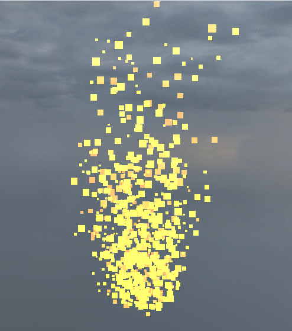
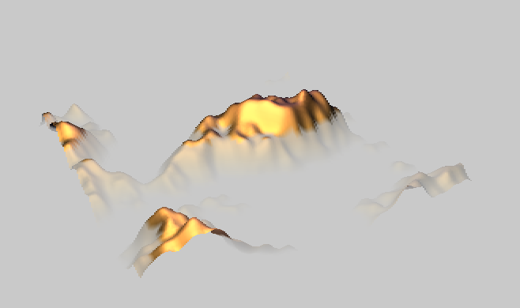

# Mystical Forest

## Progress Summary

1. **Summarize what you have accomplished so far.**

	**Enter your features from the proposal in the table below. For each feature, indicate whether you completed the implementation, it is work in progress, or you have to start it.**

	<!-- work in progress: fff3cd, completed: d4edda, upcoming (= not started): cce5ff -->

	<table>
		<thead>
			<tr>
				<th>Feature</th>
				<th>Adapted Points</th>
				<th>Status</th>
			</tr>
		</thead>
		<tbody>
			<tr>
				<td>Ambient Occlusion</td>
				<td>17</td>
				<td style="background-color: #fff3cd;">Work in progress</td>
			</tr>
			<tr>
				<td>Particle Effects</td>
				<td>17</td>
				<td style="background-color: #fff3cd;">Work in progress</td>
			</tr>
			<tr>
				<td>Fog</td>
				<td>4</td>
				<td style="background-color: #fff3cd;">Work in progress</td>
			</tr>
			<tr>
				<tr>
					<td>L-Systems for Procedural Scene Generation</td>
					<td>10</td>
					<td style="background-color: #cce5ff;">Upcoming</td>
				</tr>
			</tr>
			<tr>
				<td>Bloom</td>
				<td>5</td>
				<td style="background-color: #cce5ff;">Upcoming</td>
			</tr>
		</tbody>
	</table>

	**Add a brief summary of the goals achieved each week. A few words per cell are sufficient.**

	<table>
		<caption>Achieved Goals</caption>
		<tr>
			<th></th>
			<th>Charlie</th>
			<th>Marius</th>
			<th>Alonso</th>
		</tr>
		<tr>
			<td>Week 1 (Proposal)</td>
			<td>drafting and thinking about proposal</td>
			<td>drafting and thinking about proposal</td>
			<td>Doing research and finding papers on features</td>
		</tr>
		<tr style="background-color: #f0f0f0;">
			<td>Week 2 (Easter)</td>
			<td>vacay</td>
			<td>vacay</td>
			<td>Reread my features</td>
		</tr>
		<tr>
			<td>Week 3</td>
			<td>started on tutorial, struggle with framework</td>
			<td>start tutorial</td>
			<td>Start tutorial</td>
		</tr>
		<tr>
			<td>Week 4</td>
			<td>started on SSAO, lots more struggle with framework</td>
			<td>first version of particle generation</td>
			<td>Finish tutorial and work on fog</td>
		</tr>
	</table>

2. **Show some preliminary results.**

	**Briefly describe the results you obtained until now and the overall state of the project.**

	  

	
	
	We did not manage to have the videos display. They are at `./videos/` and are called `particles_1.mp4` and `particles_2.mp4`. 

	For SSAO, we do not have a working implementation yet. We have shaders for both the G-Buffer and the SSAO pass, as well as tentative shader renderers for both, but we are struggling to get the G-Buffer to work properly. We couldn't render anything of SSAO for the milestone.

	For the fog, we have simple linear fog shader implementation. We ran into some issues with the more complex inverse exponential fog. With more experience with the framework, this should be done quickly. The linear fog shader simply determines a fog factor for which it should mix in a fog-like color. The problem with this simple shader is that it goes opaque quickly and abruptly which isn't realistic. The exponential fog and the squared exponential fog tend to be smoother.  
	
	For the particle effects, we have a simple particle system working and managed to get a fire-like rendering. This particle system uses GPU instancing. There are a lot of fixes to add: particles fade out, make particles look rounder, add texture/texture atlas to particles, change particles color with time, and add other particle systems like amber and smoke. If we have time, we may try compute shaders.

	We have not yet merged any of the features together or designed a custom scene.

3. **Optionally present the validation of any feature you have already implemented. This is not mandatory, but can help you get useful feedback for the final report: feature validation will be the main component determining your grade.**

	We are not presenting any feature for validation.

4. **Report the number of hours each team member worked on the project.**

	<table>
		<caption>Worked Hours</caption>
		<tr>
			<th></th>
			<th>Charlie</th>
			<th>Marius</th>
			<th>Alonso</th>
		</tr>
		<tr>
			<td>Week 1 (Proposal)</td>
			<td>2h</td>
			<td>2h</td>
			<td>3h</td>
		</tr>
		<tr style="background-color: #f0f0f0;">
			<td>Week 2 (Easter)</td>
			<td>0h</td>
			<td>0h</td>
			<td>2h</td>
		</tr>
		<tr>
			<td>Week 3</td>
			<td>8h</td>
			<td>2h</td>
			<td>4h</td>
		</tr>
		<tr>
			<td>Week 4</td>
			<td>12h</td>
			<td>9h30</td>
			<td>14h</td>
		</tr>
	</table>

5. **Is the project progressing as expected? Was your workload estimate correct? Critically reflect on your work plan and assess if you are on track.**

	We think we are progressing nearly as expected, but we are a little bit behind on schedule for SSAO, as we would have liked to have a minimal viable product for the milestone. We are also behind on the fog and L-systems features, but not much. We believe our original scehdule to have been a little optimistic, as we did not expect the framework to be so difficult to work with, but we are confident that we will be able to catch up easily.

## Schedule Update

1. **Acknowledge any delays or unexpected issues, and motivate proposed changes to the schedule, if needed.**

	The biggest delay is the unexpected time needed to get even a basic understanding of the framework. We also struggled to get anything done due to other classes' projects and graded homeworks taking priority, as well as personal engagements.
	

2. **Present the work plan for the remaining weeks.**

	<table>
		<caption>Updated Schedule</caption>
		<tr>
			<th></th>
			<th>Charlie</th>
			<th>Marius</th>
			<th>Alonso</th>
		</tr>
		<tr>
			<td>Week 5</td>
			<td>SSAO</td>
			<td>Particle Effect</td>
			<td>Finish Fog + L-Systems</td>
		</tr>
		<tr>
			<td>Week 6</td>
			<td>SSAO</td>
			<td>Particle Effect</td>
			<td>L-Systems</td>
		</tr>
		<tr>
			<td>Week 7</td>
			<td>SSAO</td>
			<td>Particle Effect</td>
			<td>Bloom</td>
		</tr>
	</table>
