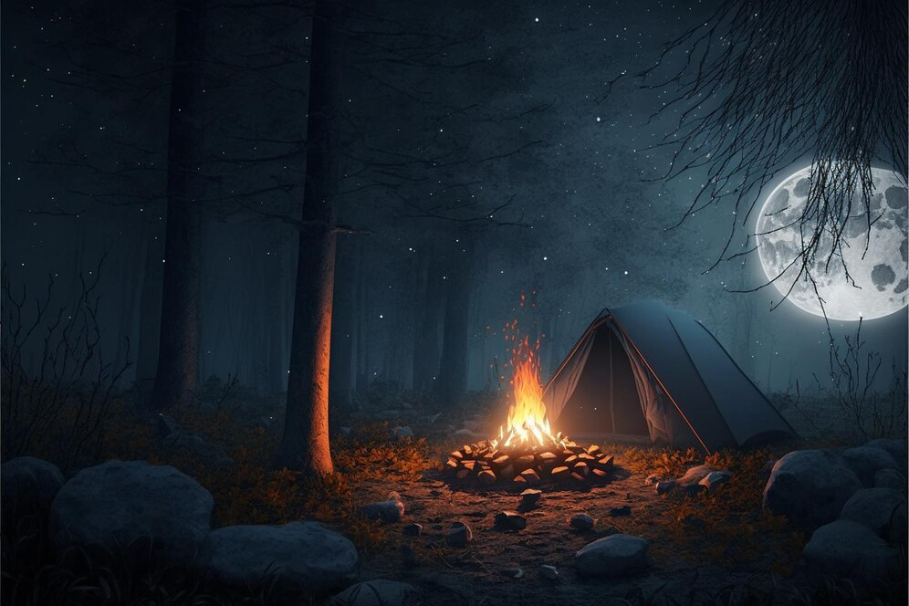

# Mystical Forest

{width="300px"}

## Abstract

In Mystical Forest, we aim to create a foggy, enchanted forest with a calming fire. Our goal is to reproduce visual effects like dynamic fog, glowing fire particles, ambient occlusion, and trees using L-Systems for Procedural Scene Generation.

We will add fire particles, L-Systems for Procedural Scene Generation for trees, and a bloom effect. We want to achieve convincing fog, integrate multiple effects, and maintaining performance.

## Features

| Feature                                       | Points | Adapted Points |
|-----------------------------------------------|--------|----------------|
| Ambient Occlusion                             | 20     | 17             |
| Particle Effects                              | 20     | 17             |
| Fog                                           | 5      | 4              |
| L-Systems for Procedural Scene Generation     | 10     | 8              |
| Bloom                                         | 5      | 4              |

## Schedule
We decided to split the work by tasks. Each task is assigned to only one member of the team. This doesn't exclude the possibility of reworking this schedule if our time estimates are wrong (or if we decide to change the tasks we are implementing).  
We want to have finished **crafting the scene**, applied the **basic effects from earlier homeworks** and finished the **fog** by the end of week 4, for the milestone submission.  
As we are above the points limit (55pts), we might let go of the bloom task if we see that we are running out of time, so as to redispatch the workload.

<table>
	<tr>
		<th style="width: 11%"></th>
		<th>Marius</th>
		<th>Alonso</th>
		<th>Charlie</th>
	</tr>
	<tr>
		<td>Week 1</td>
		<td>Project proposal  Basic effects</td>	<!-- marius -->
		<td>Project proposal  Basic effects</td>	<!-- alonso -->
		<td>Project proposal  Basic effects</td>	<!-- charlie -->
	</tr>
	<tr style="background-color: #f9f9f9;">
		<td colspan="4" align="center">Proposal</td>
	</tr>
	<tr>
		<td>Week 2</td>
		<td>(vacation)</td>	<!-- marius -->
		<td>(vacation)</td>	<!-- alonso -->
		<td>(vacation)</td>	<!-- charlie -->
	</tr>
	<tr>
		<td>Week 3</td>
		<td>Particle effects for fire  (Scene)</td>	<!-- marius -->
		<td>Scene  Fog</td>	<!-- alonso -->
		<td>Ambient occlusion  (Scene)</td>	<!-- charlie -->
	</tr>
	<tr>
		<td>Week 4</td>
		<td>Particle effects <i>(cont'd)</i>  Milestone report</td>	<!-- marius -->
		<td>Fog <i>(cont'd)</i>  Procedural textures for bark  Milestone report</td>	<!-- alonso -->
		<td>Ambient occlusion <i>(cont'd)</i>  Milestone report</td>	<!-- charlie -->
	</tr>
	<tr style="background-color: #f9f9f9;">
		<td colspan="4" align="center">Milestone</td>
	</tr>
	<tr>
		<td>Week 5</td>
		<td>Particle effects <i>(cont'd)</i></td>	<!-- marius -->
		<td>Procedural textures for bark <i>(cont'd)</i></td>	<!-- alonso -->
		<td>Ambient occlusion <i>(cont'd)</i></td>	<!-- charlie -->
	</tr>
	<tr>
		<td>Week 6</td>
		<td>Particle effects <i>(cont'd)</i></td>	<!-- marius -->
		<td>Bloom for firelights and fire</td>	<!-- alonso -->
		<td>Ambient occlusion <i>(cont'd)</i></td>	<!-- charlie -->
	</tr>
	<tr>
		<td>Week 7</td>
		<td>Particle effects <i>(cont'd)</i>  Video and report</td>	<!-- marius -->
		<td>Bloom <i>(cont'd)</i>  Video and report</td>	<!-- alonso -->
		<td>Ambient occlusion <i>(cont'd)</i>  Video and report</td>	<!-- charlie -->
	</tr>
	<tr style="background-color: #f9f9f9;">
		<td colspan="4" align="center">Video and Report</td>
	</tr>
</table>

## Resources

TODO

